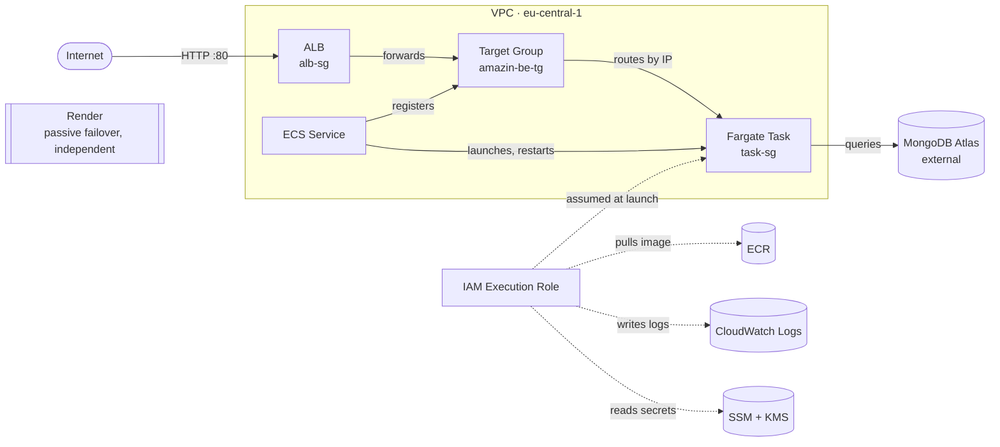
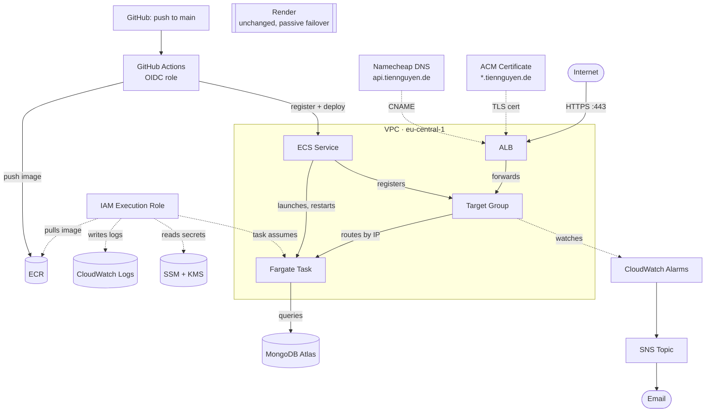

# Welcome to Amazin' Amazim Store — Backend

[](https://github.com/ntrix/amazin-be/actions/workflows/test.yml)
[](https://codecov.io/github/ntrix/amazin-be)
[](https://sonarcloud.io/summary/new_code?id=ntrix_amazin-be)
<a href="https://sonarcloud.io/summary/new_code?id=ntrix_amazin-be"></a>

## A Node.js / Express / MongoDB REST API for the Amazin Amazon (& Netflix & ...) Clone

## What is Amazin Backend?

This is the REST API powering [Amazin' Amazim Store][fenx] — a long-term personal learning project, not a commercial product. The frontend (React, Nx, Redux Toolkit) lives in a separate repo and talks to this service over HTTP; this repo is the data/auth/business-logic layer: users, products, orders, payments, image uploads, and a handful of third-party config endpoints (PayPal, Google Maps, currency rates).

### Features

- JWT authentication (sign in, register), with a bearer-token middleware gate (`checkToken`) and role guards (`isAdmin`, `isSeller`, `isSellerOrAdmin`)
- Users: sign in, register, profile update, admin user management (list/edit/delete), top-seller listing
- Products: list/search/filter, categories, CRUD (seller/admin only), product reviews
- Orders: create, pay, deliver, list mine / list all (seller/admin), delete (admin)
- Image uploads via Multer + Cloudinary
- Config endpoints: PayPal client id, Google Maps key, live currency rates, crypto/BTC history
- Contact form submission (SendGrid)
- Input validation via `express-validator` (`middleware/validate.js`)
- Security headers via `helmet`, CORS enabled
- Error tracking via [Sentry][sentry] — only real unhandled 500s, not expected `AppError` rejections
- Structured logging via [pino][pino] (`pino-http`), replacing raw `console.*`
- Typed error hierarchy (`lib/errors.js`) driving a single, consistent HTTP status code per failure — no more ad-hoc 402/406/411/417/503 misuse
- Versioned DB migrations ([migrate-mongo][migratemongo]) instead of hand-run scripts: query indexes, and a data migration seeding realistic (and intentionally scarce, for one product) stock levels
- Orders check stock atomically on creation (`findOneAndUpdate` + `$gte`/`$inc`) — rejects overselling without needing a full multi-document transaction

## Tech stack

![Tech Stack Backend][stackbe]

- [Node.js][node]
- [Express][express]
- [MongoDB][mongo] + [Mongoose][mongoose]
- [MongoDB Atlas][atlas] (hosted cluster)
- [Cloudinary](https://cloudinary.com/) (image hosting)
- [SendGrid](https://sendgrid.com/) (contact form email)
- `jsonwebtoken` + `bcryptjs` (auth)
- [Docker](https://www.docker.com/) (multi-stage build, non-root user) — same image runs locally, on Render, and on AWS
- Deployed on [Render](https://render.com/) (passive failover) and [AWS ECS Fargate](https://aws.amazon.com/fargate/) behind an Application Load Balancer — previously Heroku, then Cyclic.sh (both since discontinued/shut down)

## Source code

Backend (this repo): [github.com/ntrix/amazin-be][bev1]

Frontend: [github.com/ntrix/amazin][fenx]

## Learning by Doing

Same philosophy as the frontend repo — small steps, revisited often, honestly tracked.

| Part | Description                                                                  | Status   |
| ---- | ----------------------------------------------------------------------------- | -------- |
| 01   | Initial API: users, products, orders, auth                                    | Done     |
| 02a  | Deploy on Heroku                                                               | Done     |
| 02b  | Migrate to Cyclic.sh (serverless), later shut down (2024)                     | Done     |
| 02c  | Migrate to [Render][render] (free tier)                                       | Done     |
| 03   | MongoDB Atlas cluster resumed after long inactivity pause                     | Done     |
| 04   | `engines.node` updated `12.x` → `24.x` (Node 12 unsupported on modern hosts)  | Done     |
| 05   | Fix `ERR_HTTP_HEADERS_SENT` crash loop: dead `frontend/build` static mount, missing `next` param on error handler, `writeHead()` clobbering `.status()` | Done |
| 06   | Automated tests: Vitest + Supertest + mongodb-memory-server                   | Done     |
| 07   | CI (GitHub Actions) + [Codecov][codecov] + [SonarQube Cloud][sonar]           | Done     |
| 08   | Repo switched from private to public (09/2026)                                | Done     |
| 09a  | Containerized with Docker (multi-stage build on `node:24-alpine`, non-root user, HTTP healthcheck) | Done |
| 09b  | Render switched to run the same Docker image via Blueprint (`render.yaml`), replacing the native Node build | Done |
| 10a  | AWS Migration — new AWS account set up from scratch: IAM user with MFA (no root for daily use), AWS Budgets configured before any billable resource | Done |
| 10b  | AWS Migration — migrated to AWS ECS Fargate + Application Load Balancer (image in ECR, secrets in SSM Parameter Store, dedicated IAM execution role) — Render kept running as a live failover throughout | Done |
| 10c  | AWS Migration — HTTPS on the AWS endpoint via a free ACM certificate and a custom subdomain (`api.tiennguyen.de`) | Done |
| 10d  | AWS Migration — CloudWatch Alarms (unhealthy target, 5xx errors) → SNS email, so downtime pages instead of waiting to be noticed | Done |
| 10e  | AWS Migration — GitHub Actions CI/CD (build → ECR → ECS deploy) authenticating via OIDC, no AWS keys stored in GitHub | Done |
| 11a  | Pre-commit tooling: Husky + lint-staged + commitlint (Conventional Commits enforced) | Done |
| 11b  | Real ESLint config wired into CI — `eslint` had been a dependency for a while but never actually configured; the first real run caught a live crash bug (`adminUpdate` referencing an undefined variable) | Done |
| 11c  | Structured logging (pino) replacing `console.*`; fixed a real unhandled-rejection crash in the contact form along the way (an unawaited SendGrid call) | Done |
| 11d  | Typed `AppError` hierarchy — normalized 9 groups of previously-arbitrary HTTP status codes (401/402/403/406/411/417/503 misuse) to their correct meaning, one focused commit per group | Done |
| 11e  | DB migrations via `migrate-mongo`: first real migration adds the query indexes that were missing on `category`/`seller`/`user`; a second seeds realistic (and intentionally scarce, for one product) stock levels for testing "out of stock" | Done |
| 11f  | Orders check stock atomically on creation instead of trusting a stale read — rejects overselling, no full multi-document transaction needed for this shape of write | Done |
| 11g  | Test suite grew from 14→22 files / 40→67 tests (~53%→70% line coverage), adding the 3 most business-critical flows (auth, product search, reviews) plus order payment confirmation and self-service profile updates | Done |
| 11h  | Fixed a real seed-data bug: 2 duplicate product names were silently violating a unique index and truncating the demo dataset on every fresh seed | Done |
| 11i  | Fixed a flaky CI test run: `mongoose.connect()` uses the single default connection, so running test files in parallel raced it between files and leaked data across them — serialized file execution instead | Done |
| 12a  | Error tracking with [Sentry][sentry] (free Developer plan), wired into the existing error handler to report only real unhandled 500s, not expected `AppError` rejections | Done |

## Architecture

### ECS Fargate, right after first going live (plan)



### Full picture, after custom domain, monitoring, and CI/CD (actual result)



## Test Coverage

Unit tests run on every push/PR via GitHub Actions, with coverage reported to Codecov and code smells to SonarQube Cloud (badges at the top of this page).

- 19 test files, 56 tests
- ~63% line coverage
- Real, ephemeral MongoDB per test file (`mongodb-memory-server`) — never touches the production Atlas cluster

Organized around this API's own 4 layers (Interface → Application → Domain → Infrastructure):

| Layer | Covers | Test files |
| ----- | ------ | ---------- |
| 1. Interface — routes, app-level middleware | CORS allowlist, rate-limiting, JSON/file body-size limits, upload temp-file location | `hardening`, `bodySizeLimit`, `uploadFileSizeLimit`, `uploadTempDir` |
| 2. Application — controllers (orchestration) | Seed/backup guards, password-field exposure, product ownership enforcement, order buyer/seller/admin access, config API proxying (XSS-safe JSON), image-upload error handling, contact-form log sanitization, the 3 most business-critical flows (auth, product search/filter/pagination, reviews) | `seedGuard`, `passwordLeak`, `productOwnership`, `orderControllers`, `configXss`, `uploadErrorRejection`, `logInjection`, `authentication`, `getProducts`, `postReviews` |
| 3. Domain — framework-independent business rules | Order/product ownership rules (`domain/authorization.js`) — plain functions, no Express/Mongoose, no DB needed to test | `authorization` |
| 4. Infrastructure — persistence (models) + auth (JWT) | Unique email constraint + role defaults, required-field validation; JWT fail-fast when `JWT_SECRET_A` is missing instead of a public hardcoded fallback | `models`, `jwtSecret` |

## How to run this project

1. `npm ci`
2. Create a `.env` file with the variables below
3. `npm start` (or `npm run devstart` for auto-reload during development)

| Variable | What it's for | Where to get it |
| -------- | -------------- | ---------------- |
| `MONGODB_URL` | Database connection string | [MongoDB Atlas](https://www.mongodb.com/cloud/atlas) — free M0 cluster, add a database user, then **Connect → Drivers** and copy the URI (fill in the password yourself) |
| `JWT_SECRET_A` | Signs/verifies auth tokens | Not a service — any random string you generate yourself, e.g. `openssl rand -hex 32` |
| `CD_NAME`, `CD_API_KEY`, `CD_API_SECRET` | Image hosting | [Cloudinary](https://cloudinary.com/) free account — all three values are shown on the Dashboard home page |
| `GOOGLE_API_KEY` | Google Maps (shipping address picker) | [Google Cloud Console](https://console.cloud.google.com/) → enable **Maps JavaScript API** → **APIs & Services → Credentials** → create an API key (needs a billing account on file, but this app's usage stays inside Google's free monthly credit) |
| `PAYPAL_CLIENT_ID` | Checkout payment button | [PayPal Developer](https://developer.paypal.com/) → **My Apps & Credentials** → create a Sandbox app and copy its Client ID; leave unset and it falls back to PayPal's public sandbox id (`sb`) |
| `RATES_API_KEY` | Live currency conversion rates | [exchangeratesapi.io](https://exchangeratesapi.io/) free plan — key is shown right after signup |
| `SENDGRID_API_KEY` | Sends contact-form emails | [SendGrid](https://sendgrid.com/) free account → **Settings → API Keys → Create API Key** |
| `FROMMAIL` | Sender address for those emails | Must be a **verified sender** in SendGrid (**Settings → Sender Authentication**) — an unverified address will fail to send |
| `TOMAIL` | Inbox that receives contact-form submissions | Any email address you own — no verification needed |
| `NODE_ENV` | `development` or `production` | Set by you, not from a service |
| `SENTRY_DSN` | Error tracking — reports real unhandled 500s, not expected `AppError` rejections (400/403/409/...) | [Sentry](https://sentry.io/) free Developer plan → create a Node project → DSN is shown on setup; optional, error tracking is skipped entirely if unset |

### Or with Docker

```
docker build -t amazin-be:local .
docker run -d --name amazin-be -p 5050:5000 --env-file .env amazin-be:local
```

[node]: https://nodejs.org/
[pino]: https://getpino.io/
[sentry]: https://sentry.io/
[migratemongo]: https://github.com/seppevs/migrate-mongo
[express]: https://expressjs.com/
[mongo]: https://www.mongodb.com/
[mongoose]: https://mongoosejs.com/
[atlas]: https://www.mongodb.com/cloud/atlas
[render]: https://render.com/
[codecov]: https://codecov.io/
[sonar]: https://sonarcloud.io/
[fenx]: https://github.com/ntrix/amazin
[bev1]: https://github.com/ntrix/amazin-be
[stackbe]: https://raw.githubusercontent.com/ntrix/amazin/nx/apps/amazin/src/stories/img/mongo-express-react-node-atlas-mongoose-heroku-1000.png
